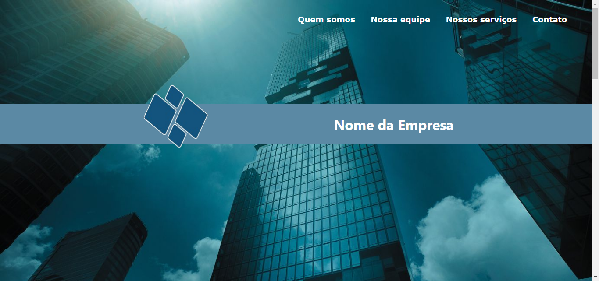
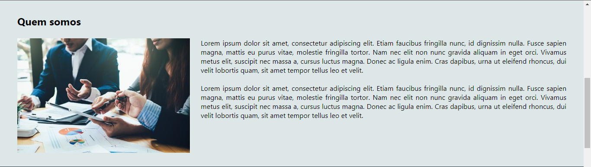
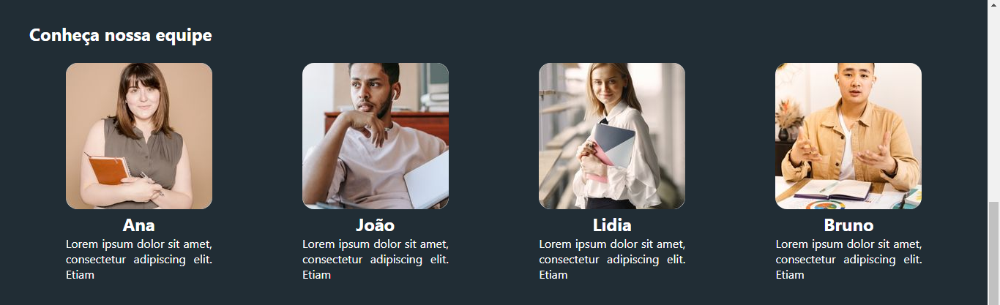
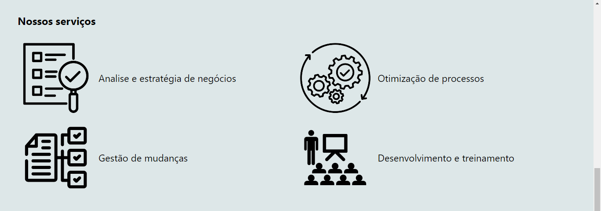
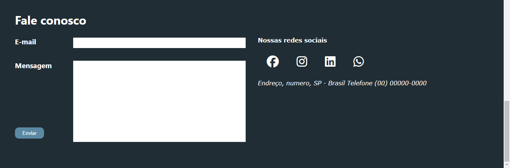

# Layout-1-Business

## Descrição:

A medida que vou progredindo em meus estudos front end sempre inicio um projeto novo para praticar. Este é o primeiro layout que desenvolvi, prototipado no Canva e codificado no VS Code. 

## Capturas de tela

## Considerações:

O layout não está responsivo por razões que precisei realizar um intervalo de 2 semanas nos estudos o que me fez perder ritmo e então resolvi prosseguir para novos projetos para recuperar o tempo perdido.
